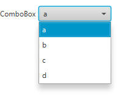

# javafx-gridform

Fluent API to create forms in a `GridPane`.

## Usage of `GridForm`

The `GridForm` constructor accepts a `GridPane`:
```java
GridPane gridPane = new GridPane();
gridPane.setHgap(4);
gridPane.setVgap(4);
GridForm gridForm = new GridForm(gridPane);
```

### Label

Row by row you define the elements in a fluent API.
This example shows that a `label()` accepts a `String` argument or a property (with `Format` if necessary).
In the case of a property the data binding is automatically set up.
```java
StringProperty stringProperty = new SimpleStringProperty("Alpha");
IntegerProperty integerProperty = new SimpleIntegerProperty(1234);

gridForm.row()
        .label("Label")
        .label(stringProperty)
        .label(integerProperty, GridForm.INTEGER_FORMAT);
```


### TextField + PasswordField + TextArea
Other GUI elements work exactly the same:
```java
StringProperty stringProperty = new SimpleStringProperty("Alpha");
DoubleProperty doubleProperty = new SimpleDoubleProperty(Math.PI);

gridForm.row()
        .label("TextField")
        .textField(stringProperty);
gridForm.row()
        .label("TextField")
        .textField(doubleProperty, GridForm.DOUBLE_FORMAT);
gridForm.row()
        .label("PasswordField")
        .passwordField(stringProperty);
gridForm.row()
        .label("TextArea")
        .textArea(stringProperty);
```


### Button

The `button()` provides a `setOnAction()` method in the fluent API.
```java
IntegerProperty integerProperty = new SimpleIntegerProperty(1234);

gridForm.row()
        .label("Button")
        .button("Click me")
        .setOnAction(button -> {
            integerProperty.set(integerProperty.get() + 1);
        });
```


### Slider

The `slider()` creates a `Slider`, which can easily be configured using the `with()` method.
```java
DoubleProperty doubleProperty = new SimpleDoubleProperty(Math.PI);

gridForm.row()
        .label("Slider")
        .slider(doubleProperty, 0, 10);
gridForm.row()
        .label("Slider")
        .slider(doubleProperty, 0, 10)
        .with(slider -> {
            slider.setShowTickMarks(true);
            slider.setShowTickLabels(true);
            slider.setMajorTickUnit(1.0);
            slider.setMinorTickCount(10);
        });
```


### ComboBox

The `comboBox()` accepts several elements to specify the possible selection in the combo box.
```java
StringProperty stringProperty = new SimpleStringProperty("Alpha");

gridForm.row()
        .label("ComboBox")
        .comboBox(stringProperty, "Alpha", "Beta", "Gamma");
```


If the elements are specified in a `ListProperty` then data binding is automatically set up.
Adding new elements to the list property will be reflected in the combo box.
```java
StringProperty stringProperty = new SimpleStringProperty();
ListProperty<String> stringListProperty = new SimpleListProperty<>(FXCollections.observableArrayList(
        "a", "b", "c"));

gridForm.row()
        .label("ComboBox")
        .comboBox(stringProperty, stringListProperty);

stringListProperty.add("d");
```



The `comboBox()` can handle any type with an appropriate `toString()` method, therefore `enum`s will work fine:
```java
public enum Animal {
    Dog,
    Cat,
    Cow,
    Fish
}
```

```java
ObjectProperty<Animal> animalProperty = new SimpleObjectProperty<>();
ListProperty<Animal> animalListProperty = new SimpleListProperty<>(FXCollections.observableArrayList(
        Animal.values()));

gridForm.row()
        .label("ComboBox")
        .comboBox(animalProperty, Animal.values());
gridForm.row()
        .label("ComboBox")
        .comboBox(animalProperty, animalListProperty);
```


### ChoiceBox

The `choiceBox()` works the same way as the `comboBox()`:
```java
ObjectProperty<Animal> animalProperty = new SimpleObjectProperty<>();

StringProperty stringProperty = new SimpleStringProperty("b");
ListProperty<String> stringListProperty = new SimpleListProperty<>(FXCollections.observableArrayList(
        "a", "b", "c"));

gridForm.row()
        .label("ChoiceBox")
        .choiceBox(stringProperty, stringListProperty);
gridForm.row()
        .label("ChoiceBox")
        .choiceBox(animalProperty, Animal.values());
```


### RadioButton (single selection)

The `radioButtons()` also accepts the same arguments as the `comboBox()`
but it will create several `RadioButton`s for the user to select the desired element.
Per default the `VBox` is used to contain the `RadioButton`s but you can provide your own `Pane` instance.  
```java
ObjectProperty<Animal> animalProperty = new SimpleObjectProperty<>();

gridForm.row()
        .label("RadioButton")
        .radioButtons(animalProperty, Animal.values());
gridForm.row()
        .label("RadioButton")
        .radioButtons(new HBox(), animalProperty, Animal.values());
```


### CheckBox (multi selection)

```java
ListProperty<String> selectedAnimalListProperty = new SimpleListProperty<>(FXCollections.observableArrayList());

gridForm.row()
        .label("CheckBox")
        .checkBoxes(selectedAnimalListProperty, stringListProperty);
gridForm.row()
        .label("CheckBox")
        .checkBoxes(new HBox(), selectedAnimalListProperty, stringListProperty);
```


### ListView (single selection)

The `listView()` can be used to bind a single property to a list of elements.
In this case a `ListView` in single selection mode is created.

```java
ObjectProperty<Animal> animalProperty = new SimpleObjectProperty<>();
ListProperty<Animal> animalListProperty = new SimpleListProperty<>(FXCollections.observableArrayList(
        Animal.values()));

gridForm.row().label("ListView")
        .listView(animalProperty, animalListProperty)
        .with(listView -> listView.setPrefHeight(24 * 4));
```


### ListView (multi selection)

The `listView()` can also be used to bind a `ListProperty` to a list of elements.
In this case a `ListView` in multi selection mode is created.

```java
ListProperty<Animal> selectedAnimalListProperty = new SimpleListProperty<>(FXCollections.observableArrayList());
ListProperty<Animal> animalListProperty = new SimpleListProperty<>(FXCollections.observableArrayList(
        Animal.values()));

gridForm.row().label("ListView")
        .listView(selectedAnimalListProperty, animalListProperty)
        .with(listView -> listView.setPrefHeight(24 * 6));
```


